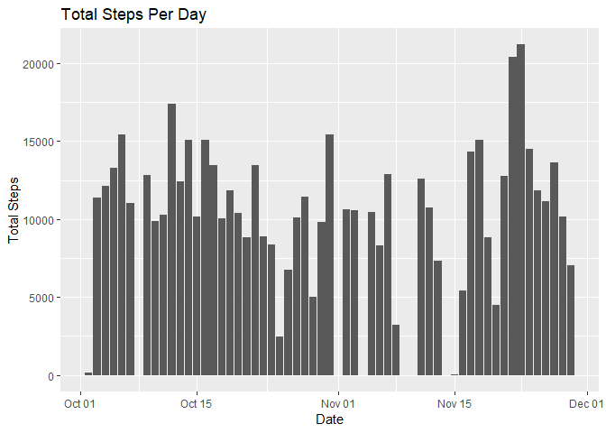
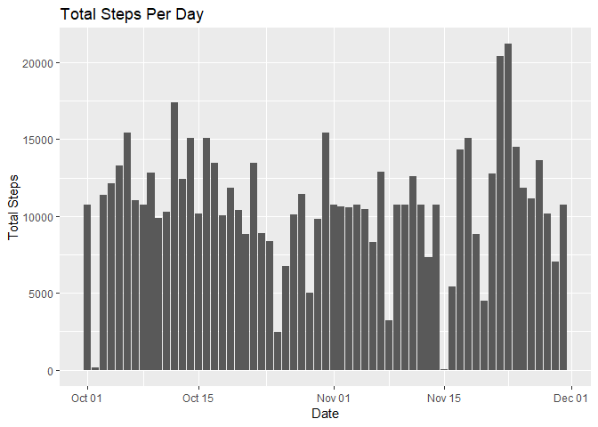
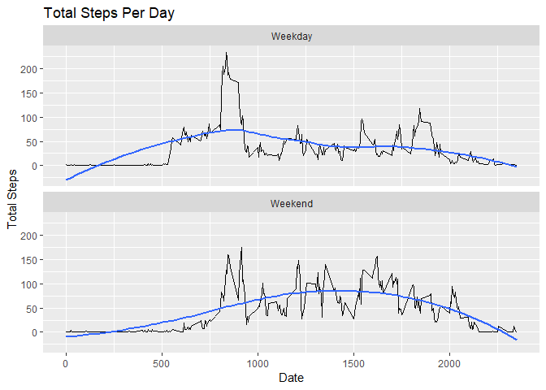

## Loading and preprocessing the data


```r
## Load Data
dfRaw <- read.csv(unzip("activity.zip"), header=TRUE, colClasses=c("integer", "Date", "integer"))
```
***
## What is mean total number of steps taken per day?

```r
# ignore NA
dtClean <- data.table(dfRaw[is.na(dfRaw$steps) == FALSE,])

# summarize by date
dtsums <- ddply(dtClean, ~date, summarize, sum=sum(steps))

# plot
ggplot(data=dtsums, mapping=aes(x=date,y=sum)) + 
    geom_bar(stat="identity") +
    ggtitle("Total Steps Per Day") +
    ylab("Total Steps") + 
    xlab("Date")
```

<!-- -->

```r
# report mean and median of total steps per day
knitr::kable(
ddply(dtClean, ~date, summarize, mean=mean(steps), median=median(steps)), caption="Daily Mean and Median")
```


Table: Daily Mean and Median

date                mean   median
-----------  -----------  -------
2012-10-02     0.4375000        0
2012-10-03    39.4166667        0
2012-10-04    42.0694444        0
2012-10-05    46.1597222        0
2012-10-06    53.5416667        0
2012-10-07    38.2465278        0
2012-10-09    44.4826389        0
2012-10-10    34.3750000        0
2012-10-11    35.7777778        0
2012-10-12    60.3541667        0
2012-10-13    43.1458333        0
2012-10-14    52.4236111        0
2012-10-15    35.2048611        0
2012-10-16    52.3750000        0
2012-10-17    46.7083333        0
2012-10-18    34.9166667        0
2012-10-19    41.0729167        0
2012-10-20    36.0937500        0
2012-10-21    30.6284722        0
2012-10-22    46.7361111        0
2012-10-23    30.9652778        0
2012-10-24    29.0104167        0
2012-10-25     8.6527778        0
2012-10-26    23.5347222        0
2012-10-27    35.1354167        0
2012-10-28    39.7847222        0
2012-10-29    17.4236111        0
2012-10-30    34.0937500        0
2012-10-31    53.5208333        0
2012-11-02    36.8055556        0
2012-11-03    36.7048611        0
2012-11-05    36.2465278        0
2012-11-06    28.9375000        0
2012-11-07    44.7326389        0
2012-11-08    11.1770833        0
2012-11-11    43.7777778        0
2012-11-12    37.3784722        0
2012-11-13    25.4722222        0
2012-11-15     0.1423611        0
2012-11-16    18.8923611        0
2012-11-17    49.7881944        0
2012-11-18    52.4652778        0
2012-11-19    30.6979167        0
2012-11-20    15.5277778        0
2012-11-21    44.3993056        0
2012-11-22    70.9270833        0
2012-11-23    73.5902778        0
2012-11-24    50.2708333        0
2012-11-25    41.0902778        0
2012-11-26    38.7569444        0
2012-11-27    47.3819444        0
2012-11-28    35.3576389        0
2012-11-29    24.4687500        0

***
## What is the average daily activity pattern?

```r
#dt <- data.table(dfRaw[is.na(dfRaw$steps) == FALSE,])

dtInt <- ddply(dfRaw, ~interval, summarize, mean=mean(steps, na.rm=T))

plot(dtInt$interval, dtInt$mean, type="l", main="Average Daily Activity Pattern", xlab="Interval", ylab="Average Steps")
```

<!-- -->

```r
# max mean interval
maxMean <- dtInt[dtInt$mean == max(dtInt$mean),]
```
The interval 835 has the maximum mean of 206.1698113.

***
## Imputing missing values

The total number of missing values is 2304.


```r
# Make a copy
dfFull <- data.frame(dfRaw)

dfFuller <- cbind(dfFull, dtInt)
dfFuller$steps <- ifelse(is.na(dfFuller$steps), dfFuller$mean, dfFuller$steps)
dfFull <- dfFuller[, c(1,2,3)]

# summarize by date
dtsums2 <- ddply(dfFull, ~date, summarize, sum=sum(steps))

# plot
ggplot(data=dtsums2, mapping=aes(x=date,y=sum)) + 
    geom_bar(stat="identity") +
    ggtitle("Total Steps Per Day") +
    ylab("Total Steps") + 
    xlab("Date")
```

<!-- -->

```r
maxMean <- dtInt[dtInt$mean == max(dtInt$mean),]
```

After imputing missing values the interval 835 has the maximum average of 206.1698113.

***
## Are there differences in activity patterns between weekdays and weekends?


```r
# Weekdays
dfWeekDays <- data.frame(dfRaw)
dfWeekDays$day <- as.factor( ifelse(weekdays(dfWeekDays$date) %in% c("Saturday","Sunday"), "Weekend", "Weekday"))

dtDayInt <- ddply(dfWeekDays, ~interval+day, summarize, mean=mean(steps, na.rm=T))

ggplot(data=dtDayInt, mapping=aes(x=interval,y=mean)) + 
    geom_line() +
    facet_wrap(~day, nrow=2) +
    geom_smooth(se=F, method="loess", formula=y~x) +
    ggtitle("Total Steps Per Day") +
    ylab("Total Steps") + 
    xlab("Date")
```

<!-- -->
