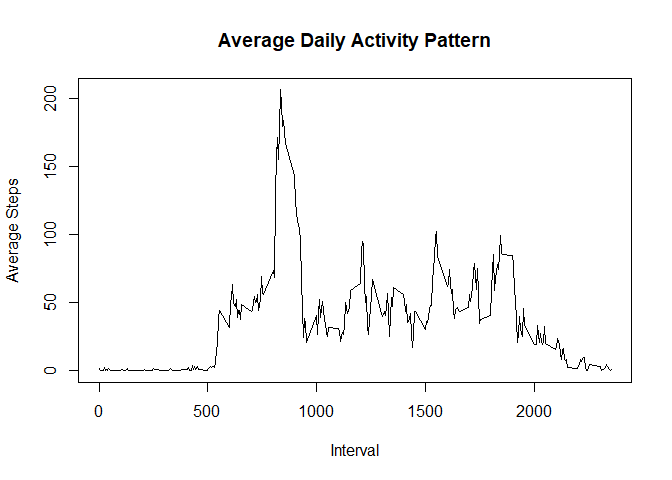
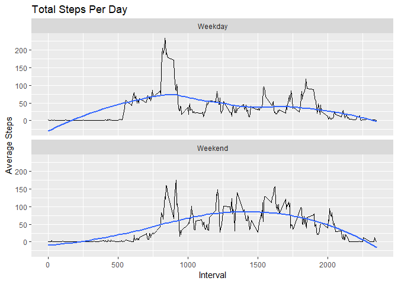

<style>
hr { border-width: 3px; border-color: #333333; }
</style>

## Loading and preprocessing the data

```r
library(plyr)
library(dplyr)
library(tidyverse)
library(data.table)
library(lubridate)
library(ggplot2)

## Load Data
dfRaw <- read.csv(unzip("activity.zip"), header=TRUE, colClasses=c("integer", "Date", "integer"))
```

***

## What is mean total number of steps taken per day?

```r
# remove all NA and make a copy
dtClean <- data.table(dfRaw[is.na(dfRaw$steps) == FALSE,])

# summarize by date
dtsums <- ddply(dtClean, ~date, summarize, sum=sum(steps))

# plot
ggplot(data=dtsums) + 
    geom_histogram(stat="identity", mapping=aes(x=date,y=sum)) +
    ggtitle("Total Steps Per Day") +
    ylab("Total Steps") + 
    xlab("Date")
```

<!-- -->

```r
# report mean and median of total steps per day
dailymean <- mean(dtsums$sum, na.rm=TRUE)
dailymedian <- median(dtsums$sum, na.rm=TRUE)
```

The daily mean is 10,766 steps and the daily median is 10,765 steps.

***
## What is the average daily activity pattern?

```r
# calculate mean by interval
dtInt <- ddply(dfRaw, ~interval, summarize, mean=mean(steps, na.rm=T))

plot(dtInt$interval, dtInt$mean, type="l", main="Average Daily Activity Pattern", xlab="Interval", ylab="Average Steps")
```

<!-- -->

```r
# max mean interval
maxMean <- dtInt[dtInt$mean == max(dtInt$mean),]
```
The interval 835 has the maximum mean of 206.

***
## Imputing missing values

The total number of missing values is 2304.


```r
# Make a copy
dfFull <- data.frame(dfRaw)

# Column bind the interval means
dfFuller <- cbind(dfFull, dtInt)
# Fill in the NAs
dfFuller$steps <- ifelse(is.na(dfFuller$steps), dfFuller$mean, dfFuller$steps)
# Select the original columns
dfFull <- dfFuller[, c(1,2,3)]

# summarize by date
dtsums2 <- ddply(dfFull, ~date, summarize, sum=sum(steps))

# plot
ggplot(data=dtsums2) + 
    geom_histogram(stat="identity", mapping=aes(x=date,y=sum)) +
    ggtitle("Total Steps Per Day") +
    ylab("Total Steps") + 
    xlab("Date")
```

<!-- -->

```r
# Get the maximum mean observation
maxMean2 <- dtInt[dtInt$mean == max(dtInt$mean),]

maxMeansAreEqual <- (maxMean$interval == maxMean2$interval & maxMean$mean == maxMean2$mean)
```

After imputing missing values the interval 835 has the maximum average of 206.
The imputed maximum (impute NAs) and the previous maximum (ignore NAs) are equal.

***
## Are there differences in activity patterns between weekdays and weekends?


```r
# Weekdays
dfWeekDays <- data.frame(dfRaw)

# add weekday factor
dfWeekDays$day <- as.factor(ifelse(weekdays(dfWeekDays$date) %in% c("Saturday","Sunday"),"Weekend","Weekday"))

# calculate mean by interval and day
dtDayInt <- ddply(dfWeekDays, ~interval+day, summarize, mean=mean(steps, na.rm=T))

# plot with data and smooth line to highlight any pattern differences
ggplot(data=dtDayInt, mapping=aes(x=interval,y=mean)) + 
    geom_line() +
    facet_wrap(~day, nrow=2) +
    geom_smooth(se=F, method="loess", formula=y~x) +
    ggtitle("Total Steps Per Day") +
    ylab("Average Steps") + 
    xlab("Interval")
```

<!-- -->
